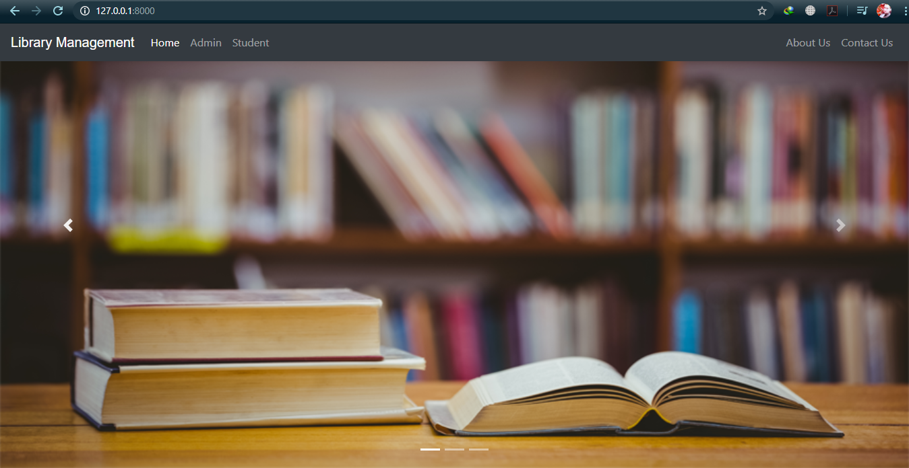
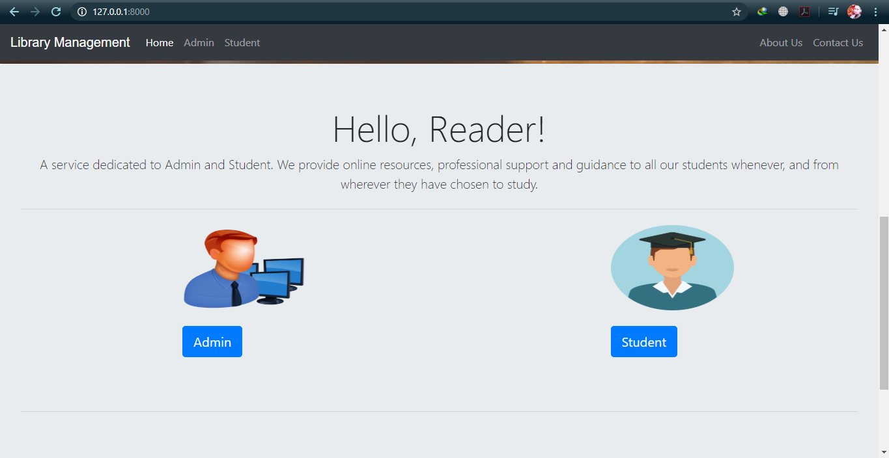
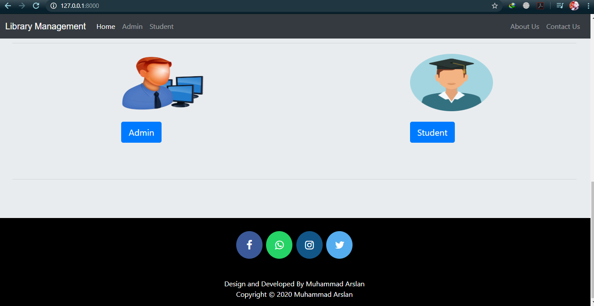
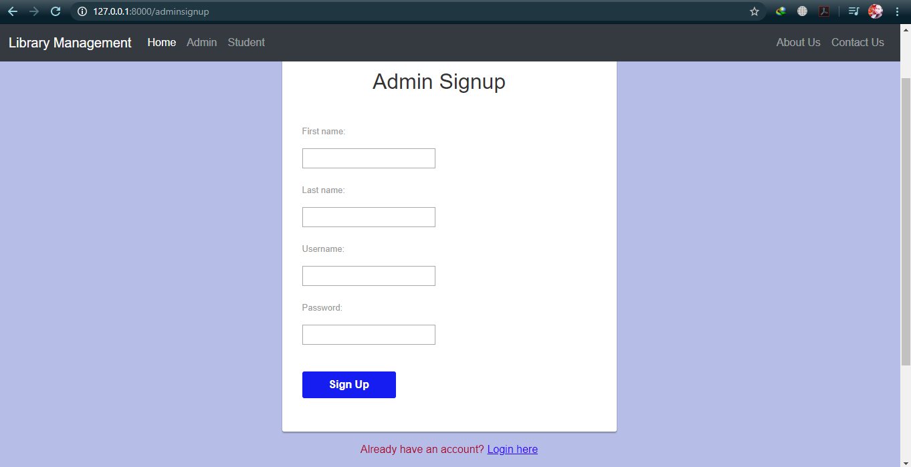
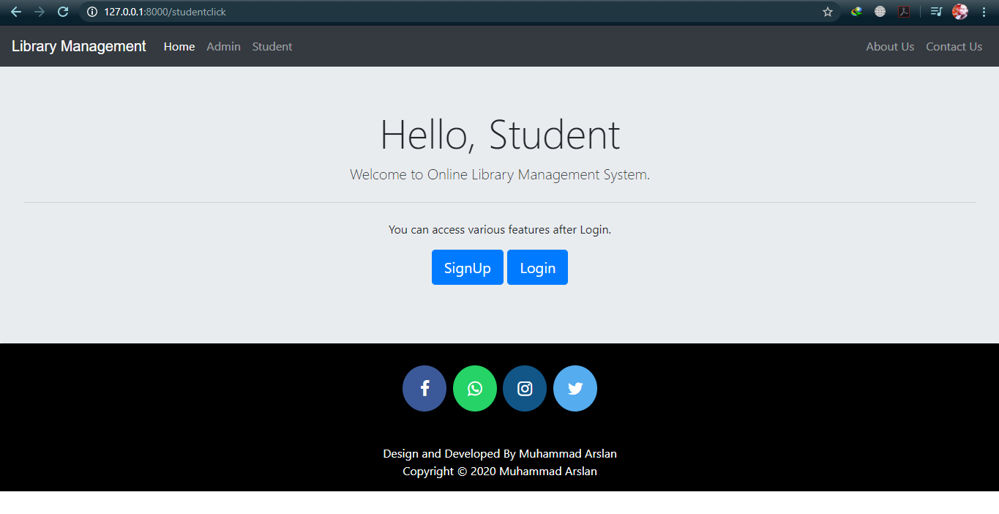
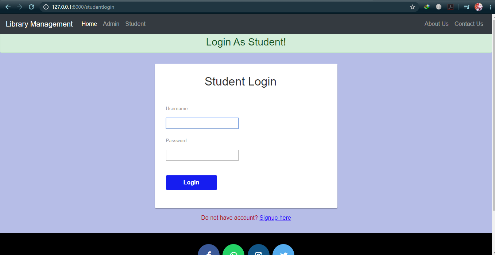
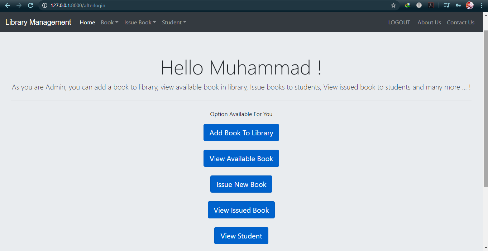
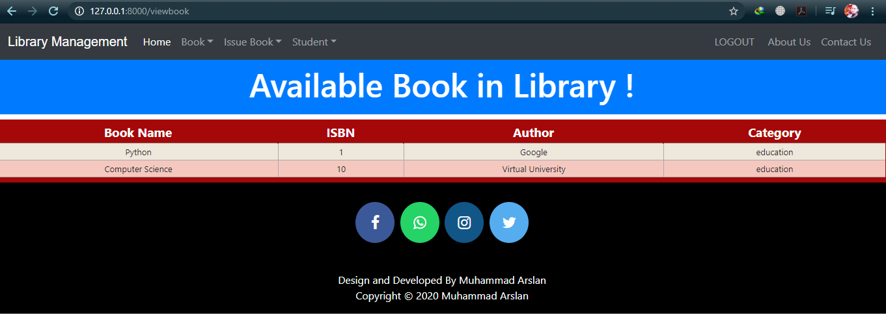

Library Management System Project 
IF you like my work give me a Star

==============================
HOW TO RUN
===============================

install ======= python (3.7.6)
install ======= django (3.0.5)

===============================

===> copy github librarymanagement clone url
===> clone or download librarymanagement folder on your desktop
===> go to librarymanagement from your CMD (terminal)

========================================================================

EXECUTE FOLLOWING COMMANDS
1) py manage.py makemigrations
2) py manage.py migrate
3) py manage.py runserver

=======================================================================

Hit the below url in any browser installed on your system
http://127.0.0.1:8000/ 

=========================================================

Things to change in settings.py
contact us will not work because you have to provide your gmail id and password
change that in settings.py

=======================================================================

Interface of the project 

